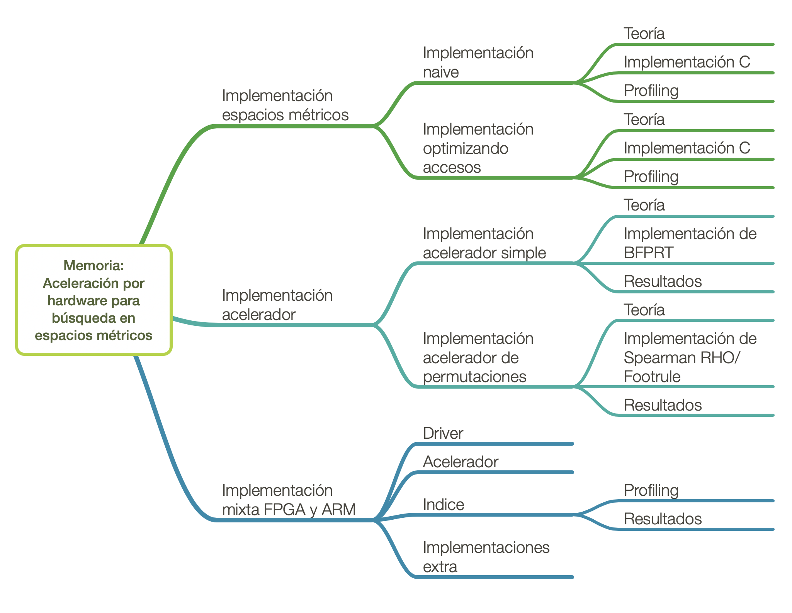

[//]: # (Tue Jan 8 16:18:22 -03 2019)
# Degree project pt. 1

After some time thinking and other events lately I've decided to finish my degree project which I left on hitaus after some CS department considered that my topic was a little too *harsh*.

## What it is anyway?

Well, the main idea was to use an FPGA to accelerate searches over metric spaces indices. This is a very old project of mine, which ended in... Failure.

Problem was, that I only have a Parallella-16 SoC to work on, and that board only comes with a 7010 Xilinix FPGA, which is easily overpowered by the ARM processor bundled in the same SoC.

## What do I plan to do now

Gonna finish my work but this time, instead of presenting the project as a whole, by presenting smaller parts of it and use those parts to get the big picture. That way, anyone could understand it.

So, in order to accomplish this, I'll be doing those things in that order, in order to finish it in aproximatedly one or two months.

And the first step will be a tutorial on how to use metric spaces. This will follow the very same contents of the degree project document, in order to be used later. First of all, necessary setup to profile a naive implementation. So, stay tuned.