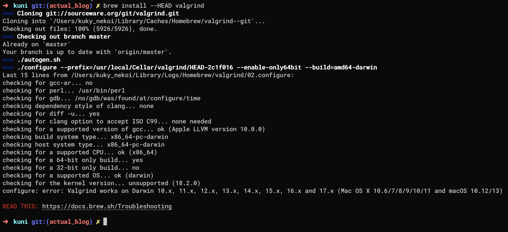
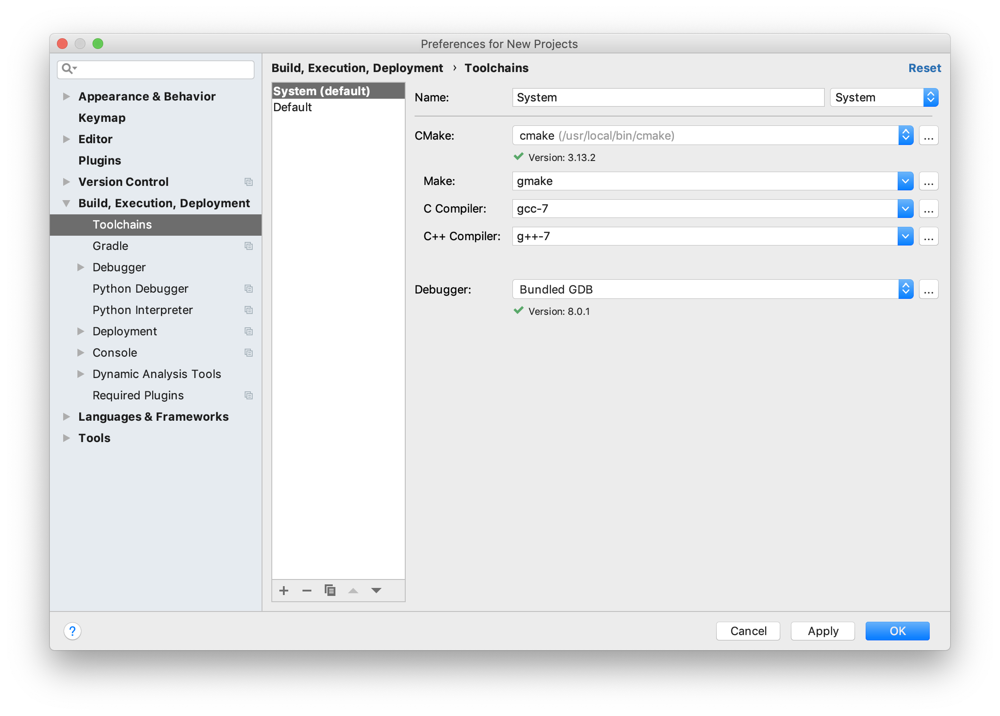
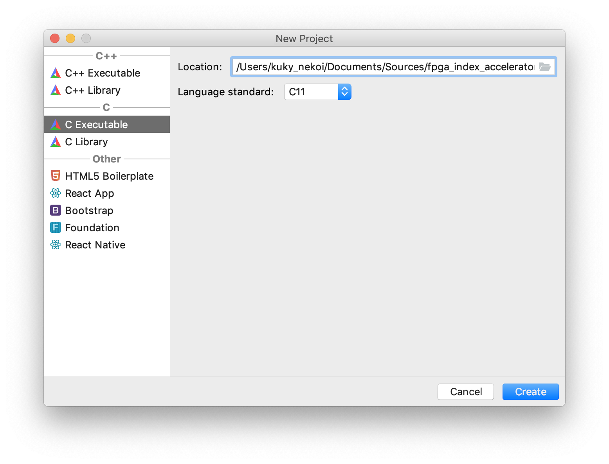

[//]: # (Tue Jan 8 18:20:38 -03 2019)
# Degree project pt. 2 - Setting up your environment with OSX with some basic

This post will cover the required tools to start developing the first implementation of our index.

## OSX and Homebrew
[Homebrew ](https://brew.sh) is a package manager which helps to install things the same way as `pacman` or `apt-get` in linux systems. Installation is pretty straightforward and you don't need to do many things after. In case you're already a Linux user, then there is no need to install this and just install the following packages using `brew install` (or their equivalents):
* valgrind
* gcc@7
* cmake
* make
* python

The problem is, for Mojave users, there is no current support for valgrind, which is the debugger that we'll be using for profiling our application.

So, after you finish your implementation, then you'll need to setup a linux virtual machine.

Also, you need to install Kagggle API, as we'll be collecting data from there in order to ease our examples.

## VSCode
Visual Studio Code is a fantastic text editor which I use on my everyday coding (except for Ruby on Rails because it sucks). You can find the download link for its installation [here](https://code.visualstudio.com/download).

Also, there are a bunch of good plugins to get you started, such as:

* [Anaconda Extension Pack](https://marketplace.visualstudio.com/items?itemName=ms-python.anaconda-extension-pack)

* [Better Align](https://marketplace.visualstudio.com/items?itemName=wwm.better-align)

* [Bracket Pair Colorizer](https://marketplace.visualstudio.com/items?itemName=coenraads.bracket-pair-colorizer)

* [C/C++](https://marketplace.visualstudio.com/items?itemName=ms-vscode.cpptools)

* [Doxygen Documentation Generator](https://marketplace.visualstudio.com/items?itemName=cschlosser.doxdocgen)

* [GitLens — Git supercharged](https://marketplace.visualstudio.com/items?itemName=eamodio.gitlens)

* [Jupyter](https://marketplace.visualstudio.com/items?itemName=donjayamanne.jupyter)

* [LaTeX Workshop](https://marketplace.visualstudio.com/items?itemName=james-yu.latex-workshop)

* [Python](https://marketplace.visualstudio.com/items?itemName=ms-python.python)

* [WakaTime](https://marketplace.visualstudio.com/items?itemName=wakatime.vscode-wakatime)

## CLion
Whilst for most work VSCode will suffice, we'll be working on a remote environment on our target platform, and IDEs like CLion make the work far more easy. It has already integrated features like CMake support, remote execution and debugging as well as profilers.

The only drawback is that is not free, but you can apply to a student licence for free or evaluate the software for 30 days. You can download it here [https://www.jetbrains.com/clion/download].

### Toolchain setup
After installing gnu versions of `make`, `cmake` and `gcc7` you need to setup those into CLion as follows:

### Creating a new project

Why there is a react native option? I do not have idea.

Next post will treat the basics of metric space indexing and such things.