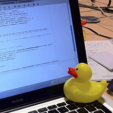

[//]: # (Sat Aug 30 03:03:29 -03 2018)
# I can't sleep. Let's do some rubber-duck debugging.

I've been trying to sleep since 9PM and despite being tired as fuck, I have not been able to. This could be kinda troublesome, as I fear that my overall performance will decrease, but probably it means that something is bugging me. I must confess that I use rubber-duck debugging for most of my everyday things so I'll explain it to you.

So, let's start debugging by using a rubber-duck!

.

## What is rubber-duck debugging?
Is a technique often used by developers, introduced in a book called "The Pragmatic Programmer", which consists on carring aroung a rubber-duck and explain your code to it, line by line. This action, allows the programmer to break their own paradigms as it becomes unable to hold information.

This works under the same principle as tricksters fool people. They give so much information in a short period of time, that makes you forget about the context and also ignore what's happening on. In the same sense, by focusing on reading the code and explain it, the developer forgets about it's own context, hence, breaks its paradigm for a short while.

## Ok, and where I can use it.
This method is often used at programming contests. There is very common problem on when you have a team of three people. So, it's supposed that whilst one of them is programming a solution, the other two are working trying to devise the solution for the next one. But, consider this scenario:

Contestant A starts working in a problem, whilst Contestant B is working on another. Now Contestant C is programming the solution for another problem. Then A gets stuck for a minute, and decides to ask B for help. Then, B loses focus on their work and starts helping A. Due to pressure, there is a high chance (if the team are composed of begginners) to think on that problem to be easier to solve by having more people focused on it. 

While A explains to B the problem -becuase even of B reads the problem statement, it will need the context- B will start sharing the same paradigm as A. Hence getting both of them stuck. Then, the process repeats with C and you have all of your team working on the same solution, with the same method falling on the same spots.

One way to avoid (or delay) this situation is by using a *totem*, an item which gives some signal to other team members on which actions can be taken or not, and also, use it as a target of *rubber-duck debugging*.

## Paradigms are actually useful 
Maybe you'll think now that sharing paradigms is something harmful. But to be honest, it's not. Many times you'll need to find a way to share your paradigms with other developers, in order to explain what things are actually making you worry or which things you want to be considered. It also defines how problems are solved and how you see the world.

See, paradigms are actually useful.

## And you use that technique?
Yeah, I practice very often when I'm alone most of the time, but I don't have a rubber-duck tho. In the following picture you'll be able to appreciate my totem.

Sadly, I'm not able to use it at my workplace because it seems that that Flareon plushie is disturbing for some people. Also, it seems some people confuse it with talking alone, which is true, but you're not doing it because you're actually mad (?).